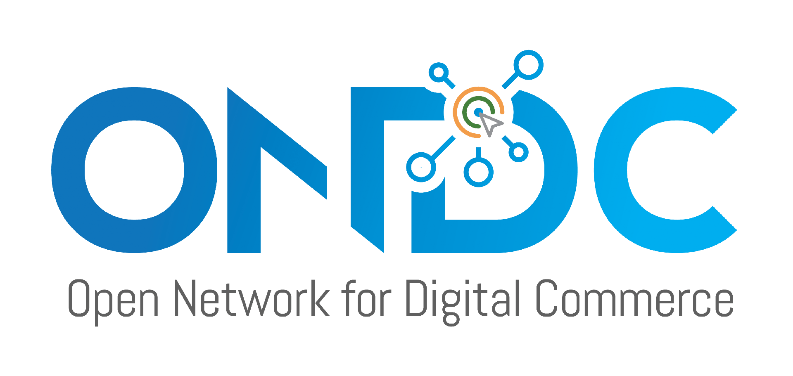

# ONDC - Open Network for Digital Commerce

ONDC is an ambitious initiative to democratize digital commerce by creating a decentralized network of buyer apps and seller apps through an interoperable protocol specification.

## Overview

This comprehensive guide is designed to walk you through the process of integrating your digital commerce platform with the Open Network for Digital Commerce (ONDC). By following these steps, you'll enable seamless interoperability with the decentralized network, allowing your platform to leverage the benefits of ONDC.

## Table of Contents

1. [Getting Started](#getting-started)
2. [Quick Start Guide](#quick-start-guide)
3. [The Protocol](#the-protocol)
4. [Subscription Process](#subscription-process)
5. [Signing and Verification](#signing-and-verification)
6. [Enabled Domains](#enabled-domains)
7. [Reference Applications](#reference-applications)
8. [Utilities and Sandboxes](#utilities-and-sandboxes)
9. [Taxonomies](#taxonomies)
10. [Product Requirement Documents (PRDs)](#product-requirement-documents)
11. [Gateway and Registry Endpoints](#gateway-and-registry-endpoints)
12. [Network Observability for Production](#network-observability-for-production)
13. [Catalog and Store Rejection](#catalog-and-store-rejection)

## Getting Started

The [ONDC Web Portal](https://portal.ondc.org/) serves as a self-service platform that streamlines interaction between ONDC and its network participants across their entire lifecycle. "Network player" encompasses network participants, ecosystem partners, and other entities engaged with ONDC. The portal provides access to a range of services for network players, such as self-service onboarding, self-monitored compliance, and self-monitored operations. Creating an account on ONDC Web Portal is mandatory for starting your integration with ONDC.

## Quick Start Guide

[ONDC Integration Guide](https://docs.google.com/presentation/d/1HPRXk3lVYKmyAFcApgukZuwHhIZ_VlqR/edit#slide=id.g27b2e3e34a2_28_199) is a roadmap designed to illuminate key resources and navigate through the integration journey. 

## The Protocol

**[Beckn](https://www.youtube.com/watch?v=gefmygtzZR8&t=1s)** is an open protocol that allows local businesses across any industry to be discovered and engaged by any beckn-enabled application. **Beckn protocol** is a collection of open specifications consisting of protocol APIs, message formats, network design and reference architectures to allow any two entities to execute commercial transactions without being on the same platform. 

**ONDC** has provided the network extension layer over the Beckn Protocol (base layer). Over the base layer, the network extension layer comprises **model specifications** customised to the ONDC context that have been adopted in order to facilitate transactions over the network. For a detailed understanding of the ONDC network architecture, please refer to our [Tech Briefing Presentation](https://docs.google.com/presentation/d/17mJ_zPjEYPagc5PZuw7FS3Ftcc-Gop4U6536wStRSag/edit#slide=id.g1204a6ff419_0_56) and [Video](https://drive.google.com/file/d/1WuHCc59C45LClpbiIPomPMuTeClRZw7h/view).

### Subscription Process

To enroll in the ONDC network, Network Participants (NP) must be added to the registry. The steps for an NP to onboard onto the ONDC Registry (Staging, Pre Production, Production) are outlined as follows:

1. **Staging Registry**

   - Obtain whitelisting for the subscriber ID.
   - Initiate the subscription process by calling the /subscribe API.
     The complete process is documented [here](https://github.com/ONDC-Official/developer-docs/blob/main/registry/Onboarding%20of%20Participants.md)
2. **Pre-Production Registry**

   After presenting a demo and receiving approval from the relevant team, follow the [outlined process](https://github.com/ONDC-Official/developer-docs/blob/main/registry/Onboarding%20of%20Participants.md) to be added to the Pre-Prod registry. 
3. **Production Registry**
   Upon successfully completing functional testing and satisfying the final checklist in Pre-Production, an NP can transition to the the Production environment.

### Signing and Verification

When communicating over HTTP using Beckn APIs, the subscribers need to authenticate themselves to perform transactions with other subscribers. Due to the commercial nature of the transactions, every request/callback pair is considered to be a "contract" between two parties. Therefore, it is imperative that all requests and callbacks are digitally signed by the sender and subsequently verified by the receiver.

The complete process is documented [here](https://github.com/ONDC-Official/developer-docs/blob/main/registry/signing-verification.md). Some frequently asked questions and answers are compiled [here](https://docs.google.com/document/d/15Dpy02lqtcU9tslyMqaI4UtnD2rtwnjAbn1narO0364/edit?usp=sharing).

### Enabled Domains

Network Participants are requested to refer to the list [here](https://docs.google.com/spreadsheets/d/10yM4DtZ5cOgRf0uT2KMN6Ucd9IU_YZ__JatYYXtjc1k/edit#gid=1951317229) for ONDC defined domains and respective codes, across all environments (Staging, Pre-production and Production). The list will be updated as in when required.

Below are links to the comprehensive developer guide and model implementations for the enabled domains.

- Retail - This domain encompasses subcategories such as grocery, food and beverages, fashion, electronics, home & decor, beauty, and personal care, etc. It facilitates seamless transactions in both B2C and B2B modes, offering a comprehensive shopping experience for consumers and businesses alike.

  - B2C

    - [v1.2](https://docs.google.com/document/d/1brvcltG_DagZ3kGr1ZZQk4hG4tze3zvcxmGV4NMTzr8/edit)
    - [Test Case Scenarios - B2C](https://docs.google.com/spreadsheets/d/1JZV6ZQzXcHUsOwegGtArX3DdIXYIy3gxkhQ00q7kICc/edit#gid=1367601795)
    - [Manual Logs Checklist](https://docs.google.com/document/d/1ROAGXqj5cJkgsNWvg_xiufglhqEQDJFBgQSPcFZMZd4/edit) - Also review these checks before submitting your logs for ONDC review
    - [Commonly asked questions](https://docs.google.com/document/d/1Zb2XzrAUGGdthFqV5tRWxIzQf8XjaW22ev_lqfr3PbI/edit#heading=h.iz6kq888kevy) _(Not found the question you were looking for? Leave a comment in the document & we will revert)_
  - B2B

    - [v2.0.2](https://github.com/ONDC-Official/ONDC-RET-Specifications/tree/release-2.0.2)
    - [Test Case Scenarios - B2B](https://docs.google.com/document/d/10ouiTKLY4dm1KnXCuhFwK38cYd9_aDQ30bklkqnPRkM/edit)
  - [Retail Developer Guide](https://ondc-official.github.io/ONDC-RET-Specifications/)

     - `For B2B, select version : release-2.0.2`
     - `For B2C, select version : draft-1.x`
     - `For B2C Exports, select version : b2c_exports_2.0`
  
- Logistics - This domain streamlines the acquisition of on-network logistics services, providing logistics buyers with a variety of choices for flexible solutions that suit their specific needs.

  - [B2C Logistics v1.2](https://docs.google.com/document/d/1CkfxtqyLbSQccJZyNmf9BSGzJBH13gcLOk_tywV-LBk/edit)
  - [B2B Logistics v2.0](https://github.com/ONDC-Official/ONDC-LOG-Specifications)
  - [Logistics Developer Guide](https://ondc-official.github.io/ONDC-LOG-Specifications/)
       - `For B2B Logistics, select version : draft-2.x`
  - [Test Case Scenarios - B2C Logistics](https://docs.google.com/spreadsheets/d/1JZV6ZQzXcHUsOwegGtArX3DdIXYIy3gxkhQ00q7kICc/edit#gid=1670900093)
  - [Commonly asked questions](https://docs.google.com/document/d/17gCkt9gpnm8jA71gwEwtPPnvBo6szGeFyruvOaueL3c/edit) _(Not found the question you were looking for? Leave a comment in the document & we will revert)_
- Financial Services - This domain facilitates easy access to a spectrum of financial solutions, covering loans, insurance, investments. 

  - [Financial Services Developer Guide](https://ondc-official.github.io/ONDC-FIS-Specifications/)

       - `For Personal Loan , select Version : release-FIS12-2.0.0`
       - `For Invoice based Loan , select Version : draft-FIS12-invoice-2.1.0`
       - `For Health Insurance , select version : draft-health`
       - `For Motor Insurance , select version : draft-motor`
       - `For Marine Insurance , select version : draft-marine`
       - `For Investments , select version : draft-FIS14-enhancements`
   - [Commonly asked questions](https://docs.google.com/document/d/1JH9zAK5S3po6GRv6BCdOddxYN6AzjgO57YQE8pVn6lQ/edit) _(Not found the question you were looking for? Leave a comment in the document & we will revert)_
  - [Gift Card](https://docs.google.com/document/d/1iTCQd_jI3mRqgSiaeZBvxWL-G_wkE__xxW-Wua8arVE/edit)

- Travel & Tourism - This domain enables easy access to a range of travel-related services, covering On-demand Ride hailing with various transport modes, ticket booking without designated seat, airlines, hotels, intercity bus, entry ticket pass, etc.

  - [Mobility Specifications Developer Guide](https://ondc-official.github.io/mobility-specification/)

      - `For On-demand Ride hailing, select version : release-TRV10-2.0.1`
      - `For Unreserved Ticket Booking (metro and intracity bus), select version : release-TRV11-2.0.0`
      - `For Intercity bus ticket booking, select version : draft-TRV12-intercity`
      - `For Airlines Booking, select version : draft-TRV12-airline`
      - `For Hotel Booking, select version : draft-TRV13-hotel`
      - `For Unreserved Entry Pass (heritage sights, museums, concerts, etc), select version : draft-TRV14-2.0.0`

   - [Commonly asked questions](https://docs.google.com/document/d/138tJ_zzt5yIi46b3WsY2UeBU1rJeGXZTG4ivheT87CM/edit) _(Not found the question you were looking for? Leave a comment in the document & we will revert)_
- Services -  This domain empowers individuals to effortlessly access a diverse array of services, covering skilled services like home painting, chefs and consulations, auction of agricultural outputs, leasing farming machinery and tools, soil testing, assaying services, lab testing, subscriptions, etc.

  - [v2.0.0](https://github.com/ONDC-Official/ONDC-SRV-Specifications)
  - [Services Developer Guide](https://ondc-official.github.io/ONDC-SRV-Specifications/#)

      - `For Skilled Services, select version : release-services`
      - `For Auction of Agricultural Outputs, select version : draft-agri_bids_and_auction`
      - `For Equipment hiring (leasing farming machinery and tools), select version : draft-agri_equipment`
      - `For Soil Testing and Assaying Service, select version : draft-agri_services`
      - `For Healthcare Services (Lab Test Booking), select version : draft-healthcare`
   - [Commonly asked questions](https://docs.google.com/document/d/1e_nGOnYb4ld1kxjhOHOsXXOms96aDd6txD8Wh2wl6tk/edit) _(Not found the question you were looking for? Leave a comment in the document & we will revert)_
- Media, Entertainment, Content
  - [v2.0.0](https://github.com/ONDC-Official/ONDC-MEC-Specifications/tree/draft-print_media)
  - [Media, Entertainment, Content Developer Guide](https://ondc-official.github.io/ONDC-MEC-Specifications/)
- Ancillary Services

  - Issue & Grievance Management (IGM) within the ONDC Network serves as a critical mechanism for resolving disputes and concerns among Network Participants (NPs).
    - [v1.0.0](https://docs.google.com/document/d/1ZUS5hvS2M-TafyjAdcTY6X51VKbb9IO1fPaSquQfA0Y/edit)
    - [Commonly asked questions](https://docs.google.com/document/d/1-NULesI1Z6GQ9y4Z0loGEG5yfunX5u9woON-qxYH6w0/edit) 
  - Reconcillation and Settlement Framework (RSF) plays a pivotal role in maintaining a comprehensive trail of settlements between Network Participants.
    - [v1.0.0](https://docs.google.com/document/d/1ubUPAWpbbUJ4vG2h5TQ74srZBjYjrO0P/edit)
    - [Commonly asked questions](https://docs.google.com/document/d/19TCvuwwvOklt9Ev-SKkcXRAdvh6Qyhl9tI1Z_YavHMk/edit) 
  - Rating 
    - [v1.2.0](https://docs.google.com/document/d/1VaafY8t47hjpoW6tdezGsPwLwxxaAaGc/edit)
  - Score
    - [v1.2.0](https://docs.google.com/document/d/126O1wFdA-IuwojiAuLzdpN36vjWfQg9KOA2zRd9-zTY/edit#heading=h.bifjra7hj5b0)
  - [Test Case Scenarios (IGM &amp; RSF)](https://docs.google.com/document/d/1tx86sypacIRXgL9nlNBdvHz7cYQjQoyC/edit)

## Reference Applications

The network participants need to complete the end-to-end testing with ONDC reference applications.

**Staging Environment**

- [ONDC Reference Seller App](https://ref-app-seller-staging-v2.ondc.org/sign-up)
  - Github Repo [link](https://github.com/ONDC-Official/seller-app-sdk/tree/master)
- [ONDC Reference Buyer App](https://ref-app-buyer-staging-v2.ondc.org/login)
  - Github Repo [link](https://github.com/ONDC-Official/ondc-sdk)
- [ONDC Reference Logistics Seller (LSP) App](https://ref-logistics-app-stage.ondc.org/)
  - Github Repo [link](https://github.com/ONDC-Official/ref-logistics-app-sdk/tree/main)

**Pre-Production Environment**

- [ONDC Reference Seller App](https://seller-app-preprod-v2.ondc.org/sign-up)
  - Github Repo [link](https://github.com/ONDC-Official/seller-app-sdk/tree/master)
- [ONDC Reference Buyer App](https://buyer-app-preprod-v2.ondc.org/login)
  - Github Repo [link](https://github.com/ONDC-Official/ondc-sdk)
- [ONDC Reference Logistics Seller (LSP) App](https://ref-logistics-app-preprod.ondc.org/)
  - Github Repo [link](https://github.com/ONDC-Official/ref-logistics-app-sdk/tree/main)

## Utilities and Sandboxes

- Signing and Verification : This tool is designed to support and aid ONDC Network Participants in constructing their own cryptocurrency libraries essential for engaging with the ONDC Network. It encompasses tasks such as key generation, signing, verification, encryption, and decryption.
  - [Java](https://github.com/ONDC-Official/reference-implementations/tree/main/utilities/ondc-crypto-utility-master)
  - [NodeJS](https://github.com/ONDC-Official/reference-implementations/tree/main/utilities/ondc-crypto-sdk-nodejs)
  - [Python](https://github.com/ONDC-Official/reference-implementations/tree/main/utilities/signing_and_verification)
  - [GoLang](https://github.com/ONDC-Official/reference-implementations/tree/main/utilities/signing_and_verification/golang)
  - [PHP](https://github.com/ONDC-Official/reference-implementations/tree/main/utilities/signing_and_verification/php)
- [Subscription process](https://github.com/ONDC-Official/reference-implementations/tree/main/utilities/on_subscibe-service) : This tool aids ONDC Network Participants during the subscription process for the registry (Staging, Pre Prod, Prod). It includes the implementation of the /on_subscribe API in both NodeJS and Python.
- [Retail/IGM Log Verification](https://github.com/ONDC-Official/log-validation-utility) : This tool is designed for ONDC Network Participants to verify their transaction logs related to the Retail and IGM use cases on their end, ensuring accuracy before submission to the ONDC team for technical clearance.
- [B2B/Logistics Log Verification](https://github.com/ONDC-Official/reference-implementations/tree/main/utilities/logistics-b2b/log-verification-utility) : This tool is designed for ONDC Network Participants to verify their transaction logs related to the B2B and Logistics use cases on their end, ensuring accuracy before submission to the ONDC team for technical clearance.
- [vlookup](https://www.npmjs.com/package/vlookup-ondc) : This tool is developed to perform a registry lookup and retrieve details related to Network Participants (NP).
- [RSF Mock Server](https://github.com/ONDC-Official/mock-server-utility) : The RSF Mock Server is a tool specifically designed to test network integration for Reconcillation and Settlement Framework (RSF) , based on ONDC model implementation.
- [Sandbox](https://mock.ondc.org/) : This sandbox specifically designed to test network integration for various domains - B2B Retail, Services, B2C Exports, B2B Logistics based on ONDC model implementations.

## Taxonomies

- Taxonomies for different domains are available [here](https://drive.google.com/drive/folders/1ZdhZh7wzl4C2452zMYh7wlAvCH-x1b2R).

## Product Requirement Documents

- PRDs for different use cases are available [here](https://drive.google.com/drive/folders/14eHd-AQm-lkyBoh6JZDk1kCuVQxvTMFE).

## Gateway and Registry Endpoints

| **Environment**      | **Endpoint For**   | **URL**                                                   |
|----------------------|---------------------|-----------------------------------------------------------|
| **Staging**          | Gateway     | `https://staging.gateway.proteantech.in/search`           |
|                      | Registry    | `https://staging.registry.ondc.org/lookup`              |
|                      |                     | `https://staging.registry.ondc.org/vlookup`               |
| **Pre-Production**   | Gateway     | `https://preprod.gateway.ondc.org/search`                  |
|                      | Registry    | `https://preprod.registry.ondc.org/ondc/lookup`         |
|                      |                     | `https://preprod.registry.ondc.org/ondc/vlookup`            |
| **Production**       | Gateway     | `https://prod.gateway.ondc.org/search`                    |
|                      | Registry    | `https://prod.registry.ondc.org/ondc/lookup`              |
|                      |                     | `https://prod.registry.ondc.org/ondc/vlookup`              |

## Network Observability for Production
Refer to the following document for the Network Observability API Schema Requirements for the Production Environment.
>[Network Observability](https://docs.google.com/document/d/1dP_QTLnI1T89mCcJVfbB0S1ZJ7Ej5y3o1Sr3nplserY/edit#heading=h.blfeo5vd64pc)

## Catalog and Store Rejection
Refer to the following document for the Catalog and Store Rejection Report - Framework.
>[Catalog Rejection](https://docs.google.com/document/d/1y_kBhwSwyN2D39VucTtqEQdp7WSEGYMg/edit)

>[Swagger Document](https://app.swaggerhub.com/apis/ONDC/Catalog_Status_APIs/1.2.0#)
